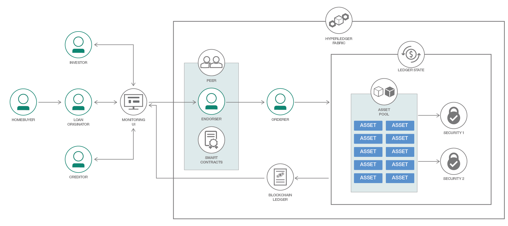

# Implement Asset Securitization on a Blockchain Ledger

In this Code Pattern, we'll demonstrate how to simulate a securitization process using React.js, Hyperledger Fabric Node SDK, and an IBM Blockchain service instance.

Securitization is a financial process that can be used to consolidate a set of illiquid assets into a set of tradable securities. A common example of an illiquid asset would be a home mortgage, as they cannot be readily bought and sold. An example of a tradable asset can be a stock or bond. This process can be useful for financial institutions that are looking to increase the liquidity of their assets and free up capital. This application provides a dashboard that will allow users to create and view the relationship between Assets, Pools, Investors, and Securities.

When the reader has completed this Code Pattern, they will understand how to:

* Deploy a Hyperledger Blockchain network on IBM Cloud
* Create and enroll an administrative client using the Hyperledger Node SDK
* Deploy and Instantiate a set of smart contracts to handle transactions and pool assets



## Flow

1. A homebuyer leverages the services of a Loan Originator to secure financing for a home mortgage

2. The Loan Originator loads the application, and submits requests to update the Blockchain ledger state with a new Asset

This request is handled by the node.js Express backend formats CRUD request into a [jsonrpc](http://www.jsonrpc.org/specification#examples) object like below, and submits it to a Hyperledger peer as a transaction proposal. The request below would register a mortgage with a value of $540000, an interest rate of 3.3%, and a credit score of 720. The credit score is used to calculate risk for potential investors.

```json
{
    "jsonrpc": "2.0",
    "method": "invoke",
    "params": {
        "type": "1",
        "chaincodeID": {
            "name": "securitization_contracts"
        },
        "ctorMsg": {
            "function": 'init_asset',
            "args": '["asset1" , "540000", "0.033", "720"]'
        },
        "secureContext": "kkbankol@us.ibm.com"
    },
    "id": "5"
}
```

3. Peer uses an "endorsement" service to simulate the proposed transaction against the relevant smart contracts. This endorsement service is used to confirm that the transaction is possible given the current state of the ledger. Examples of invalid proposals might be creating an asset that already exists, querying the state of an asset that does not exist, etc.

4. If the simulation is successful, the proposal is then "signed" by the peer's endorser.

5. The signed transaction is forwarded to an ordering service, which executes the transaction. In this case, the newly created "Asset" would be placed in an "Asset Pool"

6. The updated state is committed to the blockchain ledger

7. The Securitization UI queries the updated ledger state and renders tables with the updated information

8. If the Asset Pool has been split up into "Securities", an investor has the ability to buy and sell them. The security price should be updated every time there is a change to the ledger state

9. A creditor checks the ledger state to determine the risk of losses by late payments or mortgages going into default. If a significant change is found, the security credit rating will be recalculated by the creditor and updated in the ledger.

## Install Prerequisites:
### IBM Cloud CLI
To interact with the hosted offerings, the IBM Cloud CLI will need to be installed beforehand. The latest CLI releases can be found at the link [here](https://console.bluemix.net/docs/cli/reference/bluemix_cli/download_cli.html#download_install). An install script is maintained at the mentioned link, which can be executed with one of the following commands

```bash
# Mac OSX
curl -fsSL https://clis.ng.bluemix.net/install/osx | sh

# Linux
curl -fsSL https://clis.ng.bluemix.net/install/linux | sh

# Powershell
iex(New-Object Net.WebClient).DownloadString('https://clis.ng.bluemix.net/install/powershell')
```
After installation is complete, confirm the CLI is working by printing the version like so

```bash
ibmcloud -v
```

```bash
# Log in
ibmcloud login
```

Finally, install the container service plugin, which is required to interact with IBM Kubernetes deployments
```bash
ibmcloud plugin install container-service -r Bluemix
```

### Kubernetes CLI

```bash
# OS X
curl https://storage.googleapis.com/kubernetes-release/release/v1.11.7/bin/darwin/amd64/kubectl -P /usr/local/bin/
# Linux
curl https://storage.googleapis.com/kubernetes-release/release/v1.11.7/bin/linux/amd64/kubectl -P /usr/local/bin/

chmod +x /usr/local/bin/kubectl
kubectl -v
```

<!-- # Windows
curl https://storage.googleapis.com/kubernetes-release/release/v1.11.7/bin/windows/amd64/kubectl.exe -->


### Node.js packages

If expecting to run this application locally, please install [Node.js](https://nodejs.org/en/) and NPM. Currently the Hyperledger Fabric SDK only appears to work with node v8.9.0+, but [is not yet supported](https://github.com/hyperledger/fabric-sdk-node#build-and-test) on node v9.0+. If your system requires newer versions of node for other projects, we'd suggest using [nvm](https://github.com/creationix/nvm) to easily switch between node versions. We did so with the following commands

```bash
curl -o- https://raw.githubusercontent.com/creationix/nvm/v0.33.11/install.sh | bash
# Place next three lines in ~/.bash_profile
export NVM_DIR="$HOME/.nvm"
[ -s "$NVM_DIR/nvm.sh" ] && \. "$NVM_DIR/nvm.sh"  # This loads nvm
[ -s "$NVM_DIR/bash_completion" ] && \. "$NVM_DIR/bash_completion"  # This loads nvm bash_completion
nvm install v8.9.0
nvm use 8.9.0
```

To run the Securitization UI locally, we'll need to install a few node libraries which are listed in our `package.json` file.
- [React.js](https://reactjs.org/): Used to simplify the generation of front-end components
- [MQTT](http://mqtt.org/): Client package to subscribe to Watson IoT Platform and handle incoming messages
- [Hyperledger Fabric SDK](https://fabric-sdk-node.github.io/): Enables backend to connect to IBM Blockchain service

## Included components
* [IBM Blockchain](https://console.bluemix.net/catalog/services/blockchain)

## Featured technologies
* [Hyperledger Fabric](https://hyperledger-fabric.readthedocs.io/en/release-1.1/)
* [Hyperledger Node.js SDK](https://github.com/hyperledger/fabric-sdk-node)
* [NPM](https://www.npmjs.com/)
* [Node.js](https://nodejs.org/en/)
* [React.js](https://reactjs.org/)


# Steps

There are two methods we can use to deploy the application, either run everything locally on your development machine, *OR* initialize a hosted blockchain service and run in IBM Cloud. These separate steps are labeled as **local** or **hosted**, respectively

1. [Clone repository](#1-clone-the-repository)
2. [Provision Blockchain + Kubernetes services in IBM Cloud Platform](#2-provision-cloud-services)
3. [Configure IBM Cloud Services](#3-configure-ibm-cloud-services)
<!-- 5. [Start the Application](#5-run-the-application) -->
4. Configure and Deploy application [locally](#4-deploy-application-locally) OR [On IBM Cloud](#4-deploy-application-on-ibm-cloud)
5. [Import Service Credentials](#5-import-service-credentials)
6. [Configure Application](#6-populate-application-data)

<!-- 7. [Configure and run the application](#7-ui-configuration) -->

## 1. Clone the repository

Clone the `securitization_blockchain` project locally. In a terminal, run:

```bash
git clone https://github.com/IBM/securitization_blockchain.git
```

## 2. Provision Cloud Services (**hosted**)

Next, we'll need to deploy our service instances using the IBM Cloud dashboard. This step is only required if you're using a hosted Blockchain service instead of a local Hyperledger network.

### Blockchain

The IBM Blockchain service can be found by logging in to the IBM Cloud [dashboard](https://console.bluemix.net/), selecting the `Catalog` button, searching for "Blockchain", and clicking on the resulting icon. Or click this [*link*](https://console.bluemix.net/catalog/services/blockchain).


After selecting the blockchain icon, a form will be presented for configuring the service name, region, and pricing plan. The default values for these fields can be left as is. After validating that the information in the form is correct, scroll down and click the `Create` button in the lower right corner


### Kubernetes

Create a Kubernetes cluster [here](https://console.bluemix.net/containers-kubernetes/catalog/cluster/create). The free offering will suffice for this demo app. Kubernetes will be used to deploy a Ubuntu container running the express and react applications

<!-- TODO ADD Photos -->


Run the following command to download the configuration file for your cluster. The "mycluster" parameter is the default cluster name (as seen in above screenshot). Be sure to change this parameter if you entered a custom cluster name.

```bash
ibmcloud cs cluster-config mycluster
```

The result of the previous command will download a configuration file which will be used to connect to the Container service. The output will contain an export command like so

```
export KUBECONFIG=/Users/$USER/.bluemix/plugins/container-service/clusters/mycluster/kube-config-hou02-mycluster.yml
```

After running the command above, confirm that the kubernetes cli can communicate with the container service by running the following
```bash
kubectl get nodes
```

<!-- Provision the following services:
* [**IBM Blockchain**](https://console.bluemix.net/catalog/services/blockchain)
* [**Watson IoT Platform**](https://console.bluemix.net/catalog/services/internet-of-things-platform) -->

## 3. Configure IBM Cloud Services

In this section, we'll be uploading our securitization logic to the Blockchain service.

"Smart contracts", commonly referred to as "Chaincode", can be used to execute business logic and validate incoming requests. In this context, the contracts are used to initialize all participants of the securitization process, define their relationships, and verify transactions. These contracts can be hosted either on IBM Cloud or on a local Hyperledger network managed by Docker.

### IBM Cloud Hosted Hyperledger (**hosted**)
To begin the process of uploading the smart contracts (also referred to as "chaincode") to the hosted blockchain service, we can start by opening the IBM Cloud dashboard, selecting your provisioned Blockchain service, and accessing the blockchain network monitor by clicking "Enter Monitor"


Next, click the "Install code" option on the left hand menu, and then the "Install Chaincode" button on the right of the page


Enter an id and a version (here we'll use "sec" and "v1"). Then, select the "Choose Files" button to upload the smart contracts, which are titled [lib.go](chaincode/src/lib.go), [read_ledger.go](chaincode/src/read_ledger.go), [write_ledger.go](chaincode/src/write_ledger.go), and [securitization.go](chaincode/src/securitization.go). These files are located in the `chaincode/src` directory of this project


Finally, we'll need to "instantiate" the chaincode. This can be done by opening the chaincode "Actions" menu and selecting "Instantiate". This will present a form where arguments can be provided to the chaincode `init` function. In this case, we'll just need to provide an integer (we used `"101"`) to the Arguments section, then click "Next" and then "Submit"


### Hyperledger Network Setup (**local**)
<!-- If you're planning to make custom changes to the smart contracts, it may be faster to develop and test chaincode locally before pushing to a hosted service.  -->
As an alternative to the hosted IBM Blockchain service, we can deploy a local Hyperledger network using docker-compose in a script like so.

Enter the `local` directory
```bash
cd local
```

Run the "stopFabric" script to clean up by removing any residual Hyperledger containers. This will also remove the `securitization` container if it exists.
```bash
./stopFabric.sh
```

Start a new Hyperledger network
```bash
export COMPOSE_PROJECT_NAME=net
./startFabric.sh
```

The network can be deleted at any time by running `./stopFabric.sh`

<!-- Next, run the the [installChaincode.sh](local/installChaincode.sh) script, which will installs and instantiates the smart contracts on the Hyperledger network.
```
./installChaincode.sh
``` -->

Next, copy the chaincode artifacts to the docker cli container
```
docker cp ../chaincode/src/ cli:/opt/gopath/src/github.com/securitization
```

Now we can run a series of docker commands to install and instantiate the chaincode from the `cli` container.

First, we'll install the chaincode

`
docker exec -e "CORE_PEER_LOCALMSPID=Org1MSP" -e "CORE_PEER_MSPCONFIGPATH=/opt/gopath/src/github.com/hyperledger/fabric/peer/crypto/peerOrganizations/org1.example.com/users/Admin@org1.example.com/msp" cli peer chaincode install -n securitization -v 1.0 -p github.com/securitization
`

And instantiate the chaincode

`
docker exec -e "CORE_PEER_LOCALMSPID=Org1MSP" -e "CORE_PEER_MSPCONFIGPATH=/opt/gopath/src/github.com/hyperledger/fabric/peer/crypto/peerOrganizations/org1.example.com/users/Admin@org1.example.com/msp" cli peer chaincode instantiate -o orderer.example.com:7050 -C mychannel -n securitization -v 1.0 -c '{"Args":["101"]}'
`

Once this is complete, we can invoke smart contracts using `docker exec` like below. this invoke call runs the `read_everything` function, which prints all assets, securities, etc.

`
docker exec -e "CORE_PEER_LOCALMSPID=Org1MSP" -e "CORE_PEER_MSPCONFIGPATH=/opt/gopath/src/github.com/hyperledger/fabric/peer/crypto/peerOrganizations/org1.example.com/users/Admin@org1.example.com/msp" cli peer chaincode invoke -o orderer.example.com:7050 -C mychannel -n securitization -c '{"Args":["read_everything"]}'
`


## 4. Deploy Application on IBM Cloud (**hosted**)

<!-- [](https://bluemix.net/deploy?repository=https://github.com/IBM/securitization_blockchain.git&branch=master) -->

<!-- 1. We can deploy the application to IBM Cloud, by either leveraging the "Deploy to IBM Cloud" button directly above, or by using the IBM Cloud CLI. Ensure the cli is installed using the prerequisites section above, and then run the following command to deploy the application -->
<!-- Before running this section, please confirm that the -->

<!-- ```bash
# Log in using IBM Cloud credentials
ibmcloud login
``` -->

Deploy the kubernetes application with the following command
```bash
kubectl apply -f kubernetes/kube-config.yml
```

If successful, you should get the following output
```bash
Kalonjis-MacBook-Pro:securitization_blockchain kkbankol@us.ibm.com$ kubectl apply -f kubernetes/kube-config.yml
service/api-service created
pod/securitization-pod created
```

This may take a few minutes. In a different tab, folloing along by running the `logs` command like so.
```bash
kubectl logs -f securitization-pod
```

We should get output saying the backend and react servers have started. Continue on to access the application
<!-- To access the pod filesystem, run the following commands
```
kubectl get pods
kubectl exec -it ${pod_name} bash
``` -->

Find the public ip address of the Kubernetes cluster
```bash
# Get id of cluster (if it's not the default "mycluster")
ibmcloud ks clusters

# Print workers associated with cluster, take note of public ip
ibmcloud ks workers mycluster
```

Confirm that the Node.js application is up and running by opening the following
```
<worker_public_ip>:30000
```

## 4. Deploy Application Locally (**local**)
Both `python2.7` and `build-essential` are required for these dependencies to install properly. Please refer to the `install_deps.sh` script if installing on a new system.

### Install dependencies for local application deployment
Continue by installing [Node.js](https://nodejs.org/en/) runtime and NPM. Currently the Hyperledger Fabric SDK only appears to work with node v8.9.0+, but [is not yet supported](https://github.com/hyperledger/fabric-sdk-node#build-and-test) on node v9.0+. If your system requires newer versions of node for other projects, we'd suggest using [nvm](https://github.com/creationix/nvm) to easily switch between node versions. We  can install nvm and node v8.9.0 with the following commands
```
curl -o- https://raw.githubusercontent.com/creationix/nvm/v0.33.11/install.sh | bash
# Place next three lines in ~/.bash_profile
export NVM_DIR="$HOME/.nvm"
[ -s "$NVM_DIR/nvm.sh" ] && \. "$NVM_DIR/nvm.sh"  # This loads nvm
[ -s "$NVM_DIR/bash_completion" ] && \. "$NVM_DIR/bash_completion"  # This loads nvm bash_completion
nvm install v8.9.0
nvm use 8.9.0
```

Install the required node packages by running `npm install` in the `sc-ui` directory and in the `sc-ui/react-backend` directory. Both `python` and `build-essential` are required for these dependencies to install properly:

```bash
# install react dependencies
cd sc-ui
npm install

# install express/hyperledger dependencies
cd react-backend
npm install

# return to the root project directory
cd ../../
```

Add the following entries to the /etc/hosts file. This is only necessary when running the app locally, and routes the url for each hyperledger component to localhost
```
127.0.0.1 peer0.org1.example.com
127.0.0.1 ca.example.com
127.0.0.1 orderer.example.com
```

Finally, run the application
```
cd sc-ui
PORT=30000 npm start | PORT=30001 DEPLOY_TYPE=local node react-backend/bin/www
```

### Docker setup (local alternative)
If you have Docker installed, you can install these dependencies in a virtual container instead. Run the application with the following commands, and then skip to [Step 5](#5-configure-credentials)

Build the application and dependencies in a docker image like so

```bash
docker build -t securitization-blockchain .
```

Then start the docker container with
```
docker run -it -p 30000:30000 -p 30001:30001 --name securitization -e DEPLOY_TYPE=local  --network net_basic securitization-blockchain bash -c 'cd /root/securitization_blockchain/sc-ui ; PORT=30000 npm start | PORT=30001 node react-backend/bin/www'
```

The application can instead be booted from a public image as well if there is no need to build a custom image
```
docker run -it -p 30000:30000 -p 30001:30001 --name securitization -e DEPLOY_TYPE=local  --network net_basic kkbankol/securitization-blockchain bash -c 'cd /root/securitization_blockchain/sc-ui ; PORT=30000 npm start | PORT=30001 node react-backend/bin/www'
```

<!-- This method is ideal for a development environment but not suitable for a production environment. TODO, this comment is from the original author, would like to understand why-->

To access the local Securitization application, open the following URL in a browser: `http://localhost:30000/`
<!--Add a section that explains to the reader what typical output looks like, include screenshots -->
<!-- TODO, update dashboard view -->


<!--Include any troubleshooting tips (driver issues, etc)-->


## 5. Import Service Credentials (**hosted**)

This section is only necessary for working on the hosted IBM Cloud blockchain offering. If deploying locally, you can skip to step #7. The credentials for IBM Cloud Blockchain service can be found in the ``Services`` menu in IBM Cloud by selecting the ``Service Credentials`` option for each service. If using the local network,

The Blockchain credentials consist of the `key`, `secret`, and `network_id` parameters.
<!--  -->


We'll also need to provide the Chaincode Id and Version, which is "sec" and "v1" in this example

The credentials will need to be entered in the configuration form, which can be opened by clicking the button in the upper right of the UI


After submitting this form, the UI will fetch a "connection profile" json file, which contains all information needed by our hyperledger client to connect to the blockchain ledger.

Once the connection profile has been retrieved, a certificate will be generated to allow the application to make administrative requests. These elevated privileges are required to make calls to the chaincode service. This PEM encoded certificate will be output in the terminal logs like so. If deploying on IBM Cloud, this certificate can be found parsing the logs using `kubectl logs -f securitization-pod`, or by opening the developer console in your browser  


Once the PEM certificate is generated, it can be copied and uploaded by visiting the printed url, or by revisiting the Blockchain Monitor, navigating to Members on the left hand menu, and then clicking "Certificates" and "Add Certificate"


<!-- These credentials will need to be provided to the UI in the next step -->

<!-- We can obtain the Blockchain credentials by downloading

Copy the [`env.sample`](env.sample) to `.env`.

```
$ cp env.sample .env
```
Edit the `.env` file with the necessary settings.

#### `env.sample:`

```
# Replace the credentials here with your own.
# Rename this file to .env before starting the app.

# Watson conversation
CONVERSATION_USERNAME=<add_conversation_username>
CONVERSATION_PASSWORD=<add_conversation_password>
WORKSPACE_ID=<add_conversation_workspace>

# Watson Discovery
DISCOVERY_USERNAME=<add_discovery_username>
DISCOVERY_PASSWORD=<add_discovery_password>
DISCOVERY_ENVIRONMENT_ID=<add_discovery_environment>
DISCOVERY_COLLECTION_ID=<add_discovery_collection>

# Watson Natural Language Understanding
NATURAL_LANGUAGE_UNDERSTANDING_USERNAME=<add_nlu_username>
NATURAL_LANGUAGE_UNDERSTANDING_PASSWORD=<add_nlu_password>

# Watson Tone Analyzer
TONE_ANALYZER_USERNAME=<add_tone_analyzer_username>
TONE_ANALYZER_PASSWORD=<add_tone_analyzer_password>

# Run locally on a non-default port (default is 3000)
# PORT=3000

``` -->

## 6. Configure Application
<!-- TODO, reword this -->
The securitization flow generally occurs in the following format

1. A homebuyer will apply for financing of an asset via a loan "originator". The loan will have a balance, interest rate, monthly payment, and expected time period for payback (many mortgages are roughly 30 years). A total expected payoff amount will be generated based off this information as well.

2. Once the loan has been approved and processed, the loan originator then finances the asset, and transfers the debt to a "Special Purpose Vehicle", which is a entity that protects the assets even if the originator goes bankrupt.

3. The Asset is then placed into a "Pool" along with other assets. Once Assets have been placed into a pool, a set of "securities" can be generated to allow the pool to become tradable. Each Security can be bought and sold by investors, and has a "Yield" which determines the return each security holder will receive on their investment.

4. The Homebuyer submits payments towards their mortgage.

5. Each payment is split up and distributed amongst investors who own "securities" associated with the pool. When all mortgages in the pool are paid off, each investor should have received their original investment back plus the agreed "Yield" amount. Each payment will also have a processing fee which will be dispersed to the originator

This securitization process can be replicated with this application by visiting the dashboard and creating Originators, Assets, Pools, Securities, and Investors using the provided forms. Each form requests an unique id, where the format is the name of the object type (asset, investor) followed by an integer. For example, an asset will need an ID like **asset1**, and asset pool needs an ID like **pool123**, and a security needs an ID like **security15**.

First, we'll need to create a loan "Originator", which will require an ID, Processing Fee (percentage), and (optional) Company Name. This form can be loaded by selecting the "Create Originator" button. (Note: There is a known intermittent issue with this Originator creation process, so the initial submission may fail. If this occurs, please try submitting again)


Note that the Balance and Assets fields in the table are initially blank, but will be filled in as we associate assets with the originator. And as the originator receives processing fees and security sale proceeds, their Balance will increase as well

Next, we'll create an Asset, which will require an outstanding balance, interest rate, and a payment period, which defines how many monthly payments they'll need to pay off their entire balance. This can be done by scrolling directly down to the "Assets" Table, clicking the "Create New Asset" button.


Once the Asset has been created, we can also link it to an originator using the "Transfer Asset" button


The resulting table should then reflect the following


Create an Asset Pool via the "Create Pool" form by providing an ID. We can also transfer our asset(s) to the pool using the "Transfer Asset" button in the Assets table

Create one or more "Securities". The create security form will require a ID, associated Asset Pool, and "Coupon Rate". The Coupon Rate defines the return on investment.

Finally, we can create our Investors, which have the ability to buy and sell securities. This can be done by clicking the "Create Investor" button and providing a unique id. Once the investor is created, we can then buy and sell securities using the respective buttons. So in this example, we'll do so by clicking the "Buy Security" button and providing the Security and Investor Id.

Now we can simulate a mortgage payment and view the corresponding payment distributions. We can do so by scrolling back up to the Assets table selecting the "Process Payment" view, and entering an Asset Id and Payment Amount.


Submitting the payment will then:
- Calculate the payment amount allocated to interest and principal
- Adjust the remaining balance
- Calculate and disperse payment amount owed to security holders and originator
<!-- - Place remainder in Excess Spread -->
Once these calculations are complete, the dashboard tables will then be updated with the latest ledger state


# Troubleshooting


* `sendPeersProposal - Promise is rejected: Error: 2 UNKNOWN: chaincode error (status: 500, message: Authorization for GETINSTALLEDCHAINCODES on channel getinstalledchaincodes has been denied with error Failed verifying that proposal's creator satisfies local MSP principal during channelless check policy with policy [Admins]: [This identity is not an admin]`
> This error occurs if the certificate generated by the SDK user has not been uploaded to the peer

* `Error: The gRPC binary module was not installed. This may be fixed by running "npm rebuild"`
> `grpc` is a requirement for the fabric-client SDK. Confirm that it has been installed in the `react_backend` directory with `npm install grpc@1.11.0`

* `error: [client-utils.js]: sendPeersProposal - Promise is rejected: Error: 2 UNKNOWN: chaincode error (status: 500, message: Authorization for GETINSTALLEDCHAINCODES on channel getinstalledchaincodes has been denied with error Failed verifying that proposal's creator satisfies local MSP principal during channelless check policy with policy [Admins]: [This identity is not an admin])
`
> This error occurs if the admin certificate for the hosted IBM Blockchain service has not been uploaded.

* `Objects are not valid as a React child`
> This error occurs if one of the Golang structs defined in the chaincode are invalid. These may not have nested objects. To fix this, clear cookies or open a different browser


<!-- * Error: Environment {GUID} is still not active, retry once status is active

  > This is common during the first run. The app tries to start before the Discovery
environment is fully created. Allow a minute or two to pass. The environment should
be usable on restart. If you used `Deploy to IBM Cloud` the restart should be automatic.

* Error: Only one free environment is allowed per organization

  > To work with a free trial, a small free Discovery environment is created. If you already have
a Discovery environment, this will fail. If you are not using Discovery, check for an old
service thay you may want to delete. Otherwise use the .env DISCOVERY_ENVIRONMENT_ID to tell
the app which environment you want it to use. A collection will be created in this environment
using the default configuration. -->

<!--This can stay as-is if using Deploy to IBM Cloud-->

<!--Include any relevant links-->

# Links

<!-- pick the relevant ones from below -->
# Learn more
* **Blockchain Patterns**: Enjoyed this Code Pattern? Check out our other [Blockchain Patterns](https://developer.ibm.com/code/technologies/blockchain/)

# License
This code pattern is licensed under the Apache Software License, Version 2.  Separate third party code objects invoked within this code pattern are licensed by their respective providers pursuant to their own separate licenses. Contributions are subject to the [Developer Certificate of Origin, Version 1.1 (DCO)](https://developercertificate.org/) and the [Apache Software License, Version 2](https://www.apache.org/licenses/LICENSE-2.0.txt).

[Apache Software License (ASL) FAQ](https://www.apache.org/foundation/license-faq.html#WhatDoesItMEAN)
